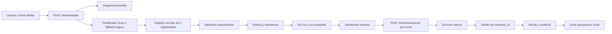

# Lumenite Action OS - Informe de Fase 1

Fecha: 9 de agosto de 2026  
Alcance: Agent Foundation y superficie mínima para operarla  
Estado: implementado en código; migración pendiente de aplicar y validar contra una instancia Supabase disponible

## 1. Objetivo

Lumenite evoluciona de planificador conversacional a una base de agente operativo con un ciclo controlado:

1. Observe: recibe instrucción, sección y contexto permitido.
2. Understand: interpreta intención y detecta datos indispensables ausentes.
3. Plan: genera un plan estructurado y limitado al catálogo registrado.
4. Authorize: evalúa membresía, rol, política, acceso, riesgo, horario y límites.
5. Execute: ejecuta en servidor usando exclusivamente un `runId` persistido.
6. Verify: vuelve a consultar el recurso creado dentro del mismo negocio.
7. Report: emite un recibo persistente y comprensible.
8. Audit: registra actor, negocio, capacidad, decisión y verificación.

No se implementaron acciones externas, OAuth, correo, WhatsApp, calendario, CRM, pagos, campañas autónomas ni webhooks.

## 2. Auditoría del sistema previo

### Estado previo de Lumenite

- Existían agentes por dominio, un snapshot de negocio, un planificador JSON y un registro declarativo de acciones.
- El endpoint de ejecución aceptaba `action_name` y payload desde el cliente.
- Solo dos acciones del registro tenían ejecución parcial.
- `lumenai_action_runs` funcionaba como telemetría simple con estados `pending`, `success` y `error`.
- El rollback genérico no revertía recursos; únicamente registraba la solicitud.

### Funciones reutilizadas

- Autenticación por cookies de Supabase.
- Resolución del negocio activo.
- Cliente administrativo limitado a rutas servidor.
- `buildLumeniteBusinessSnapshot`.
- Agentes por dominio y configuración de Groq.
- `lumenai_audit_log`.
- `lumenai_followup_tasks` para tareas internas.
- Pulse Radar, sus señales reales y su máquina de estados.
- Shell Obsidian, navegación, luces y tokens visuales existentes.

### Arquitectura previa

- Next.js 16 App Router.
- React 19.
- Supabase Auth, Postgres, RLS y Storage.
- Groq como proveedor de planificación y generación.
- Rutas API Node.js para operaciones del panel.
- Contexto multiempresa basado principalmente en `business_id` y `profiles`.

### Integraciones previas

La tabla `lumenai_integrations` ya contiene proveedor, estado, configuración, referencia de credenciales y fechas. No existen todavía adaptadores, OAuth, sincronización, webhooks, salud ni ejecutores reales asociados a proveedores externos.

### Riesgos detectados

- Ejecución descrita desde el navegador mediante un nombre de acción.
- Catálogo con capacidades sin esquema, ejecutor o verificador.
- Falta de idempotencia.
- Ausencia de aprobación persistente.
- Ausencia de verificación formal y recibos.
- Auditoría opcional que podía fallar silenciosamente.
- Falta de cancelación y undo real.
- El perfil activo por sí solo no era una base suficiente para autorizar el uso de `service_role`.
- Estados demasiado generales para representar el ciclo de un agente.

## 3. Arquitectura entregada

El texto generado nunca contiene una función ejecutable. El servidor resuelve la capacidad persistida contra `LUMENITE_ACTION_REGISTRY` y vuelve a validar su entrada antes de ejecutar.

## 4. Contrato de capacidad

Cada `LumeniteActionDefinition` incluye:

- `id`, `name`, `description`, `category` y `provider`.
- `resourceType` y `accessType`.
- `inputSchema` y `outputSchema`.
- `requiredScopes`.
- `riskLevel` y `approvalMode`.
- `supportsDryRun` y `supportsUndo`.
- `timeout` y `retryPolicy`.
- `executor`, `verifier` y `undo` cuando corresponde.
- `redactionRules`.

El módulo se detiene al cargar si el registro no coincide exactamente con las cinco capacidades de Fase 1.

## 5. Cinco acciones internas

| Capacidad | Recurso | Scope | Riesgo | Verificación | Undo |
| --- | --- | --- | --- | --- | --- |
| `internal.task.create` | `lumenai_followup_tasks` | `tasks:create` | Bajo | Tarea existente en el mismo negocio | Elimina la tarea creada |
| `internal.lead.note.add` | `lumenai_lead_notes` | `leads:notes:create` | Bajo | Nota y lead pertenecen al negocio | Elimina la nota creada |
| `internal.response.prepare` | `lumenai_response_drafts` | `conversations:drafts:create` | Bajo | Borrador y chat pertenecen al negocio | Elimina el borrador |
| `internal.conversation.tag` | `lumenai_conversation_tags` | `conversations:tags:create` | Bajo | Etiqueta y chat pertenecen al negocio | Retira solo etiquetas creadas por el run |
| `internal.reminder.create` | `lumenai_reminders` | `reminders:create` | Bajo | Recordatorio existente en el negocio | Elimina el recordatorio |

Preparar respuesta solo guarda un borrador. No envía mensajes.

## 6. Plan estructurado y simulación

El plan contiene:

- agente, intención, objetivo y resumen;
- origen de la solicitud;
- riesgo calculado desde el registro;
- datos utilizados;
- proveedor interno;
- resultado esperado;
- pasos;
- acciones validadas;
- datos faltantes;
- advertencias.

El dry-run muestra entrada redactada, recurso, tipo de acceso, scopes, riesgo, reversibilidad y decisión de autorización. Los IDs, nombres de tabla y ejecutores no son elegidos por la IA.

## 7. Autonomía y permisos

Se modelan los niveles 0 a 4:

- 0, Observador: analiza, no propone ni ejecuta.
- 1, Asesor: prepara recomendaciones, no ejecuta.
- 2, Preparador: conserva el paso como borrador.
- 3, Ejecución con aprobación: requiere confirmación humana explícita.
- 4, Autonomía limitada: solo permite bajo riesgo si la política fue configurada expresamente con autoejecución.

Política predeterminada para el propietario:

- nivel 3;
- acciones internas permitidas;
- aprobación humana obligatoria;
- autoejecución desactivada;
- undo permitido.

Miembros sin política reciben nivel 1 y no pueden ejecutar. Ninguna conversación cambia permisos.

`lumenai_agent_policies` permite especializar por negocio, usuario, rol, integración, capacidad, recurso, acceso, límite, horario, expiración, aprobación, autoejecución, undo y concedente. La administración visual de estas políticas pertenece a una fase posterior.

## 8. Idempotencia y concurrencia

- El Command Center crea un `Idempotency-Key` por solicitud.
- El servidor lo combina con negocio y usuario y genera un hash SHA-256.
- `lumenai_agent_plans` impone unicidad por negocio y request key.
- Cada run deriva una clave estable por plan, capacidad e índice.
- `lumenai_action_runs` impone unicidad por negocio e idempotency key.
- Una repetición devuelve el plan o recibo existente.
- La ejecución reclama atómicamente estados `approved` o `queued`.
- El undo reclama atómicamente `undo_status = available`.

## 9. Estados operativos

Los runs soportan:

`draft`, `planning`, `awaiting_approval`, `approved`, `rejected`, `queued`, `executing`, `verifying`, `completed`, `partially_completed`, `failed`, `cancelled`, `undo_available` y `reverted`.

Una acción que cambió datos pero no pudo verificarse o auditarse no se presenta como fallida: queda `partially_completed` y requiere atención.

## 10. Modelo de datos

### Entidades añadidas

- `lumenai_business_members`.
- `lumenai_agent_policies`.
- `lumenai_agent_plans`.
- `lumenai_action_approvals`.
- `lumenai_lead_notes`.
- `lumenai_response_drafts`.
- `lumenai_conversation_tags`.
- `lumenai_reminders`.

### Entidad ampliada

`lumenai_action_runs` incorpora plan, solicitante, aprobador, origen, capacidad, integración, riesgo, entrada redactada, snapshots, idempotencia, referencia externa, timestamps, errores seguros, verificación, recibo, undo y número de intentos.

### Reutilización

`lumenai_followup_tasks` se conserva como fuente de tareas. No se creó una segunda tabla de tareas.

## 11. Seguridad y RLS

- Toda mutación del Action OS ocurre mediante rutas servidor.
- Las tablas del agente exponen a clientes autenticados únicamente políticas `SELECT` con propiedad o membresía activa.
- No existen políticas de escritura directa para planes, runs, aprobaciones, recibos o recursos internos.
- `UPDATE` no se habilita al cliente; el servidor usa su contexto autenticado antes del cliente administrativo.
- La autorización no usa `user_metadata`.
- `requireLumeniteActionContext` verifica propietario directo o membresía activa controlada por el sistema.
- Los ejecutores comprueban que lead, chat o tarea relacionados pertenezcan al negocio activo.
- La migración no añade funciones `SECURITY DEFINER`.
- No se devuelven payloads privados ni undo payloads al navegador.
- Email y teléfono se redactan en previews textuales.

## 12. APIs

### `POST /api/panel/lumenite/plan`

Crea o recupera un plan idempotente. Devuelve plan, dry-run y runs redactados.

### `POST /api/panel/lumenite/execute`

Acepta únicamente `runId` y confirmación. Reautoriza y ejecuta la capacidad persistida.

### `PATCH /api/panel/lumenite/action-runs`

Rechaza o cancela pasos que aún no comenzaron.

### `POST /api/panel/lumenite/rollback`

Deshace por `runId` una acción marcada como reversible.

### `GET /api/panel/lumenite/action-runs`

Entrega historial redactado, aprobaciones pendientes, catálogo público y autonomía efectiva.

## 13. Pulse Radar

Pulse conserva su responsabilidad de observar y explicar. Cada señal estructurada puede ofrecer:

- la acción original para revisar evidencia;
- `Preparar con Lumenite`, que abre el Command Center con `source=pulse_radar`.

El handoff crea un plan. Nunca aprueba ni ejecuta automáticamente.

## 14. Interfaz mínima operativa

La ruta `/panel/lumenite` integra:

- command bar;
- plan estructurado;
- riesgo y permisos;
- simulación con datos redactados;
- aprobación y cancelación;
- timeline basado en estados reales;
- recibo persistente;
- bandeja de aprobaciones;
- historial;
- catálogo de cinco capacidades;
- undo;
- diseño responsive y `prefers-reduced-motion`.

Se conserva la estética Obsidian y el sistema de luces existente. No se añadieron animaciones artificiales ni porcentajes de progreso inventados.

## 15. Archivos principales

- `lib/ai/lumenite/core.ts`
- `lib/ai/lumenite/contracts.ts`
- `lib/ai/lumenite/action-registry.ts`
- `lib/ai/lumenite/action-engine.ts`
- `lib/ai/lumenite/policy-engine.ts`
- `lib/ai/lumenite/permissions.ts`
- `lib/ai/lumenite/audit.ts`
- `app/api/panel/lumenite/*`
- `app/panel/lumenite/*`
- `app/api/panel/pulse-radar/_lib.ts`
- `lib/pulse-radar/types.ts`
- `supabase/migrations/20260809044217_lumenite_action_os_foundation.sql`
- `tests/lumenite-action-os.test.mjs`

## 16. Validación realizada

- TypeScript: aprobado.
- ESLint del alcance: aprobado, sin errores ni warnings.
- Pruebas Action OS: 9 aprobadas.
- No se ejecutaron acciones externas.
- El test comprueba que `/execute` no acepte `action_name` arbitrario.
- El test comprueba catálogo exacto, autonomía, aprobación reforzada, expiración, horario, estados, undo, idempotencia estructural y RLS declarada.
- Navegador: la ruta protegida redirige correctamente a login, sin overlay, errores de consola ni overflow en 1280x720 y 390x844.

## 17. Limitaciones de validación

La migración se creó con Supabase CLI, pero todavía no se aplicó:

- `supabase db lint --local` no pudo conectar porque Postgres local no está levantado en el puerto 54322.
- `supabase db lint --linked` no pudo crear el rol de inspección por timeout del proyecto enlazado.

Por tanto, faltan la validación SQL contra Postgres real, los advisors de seguridad/rendimiento y el E2E autenticado con dos negocios. No se debe publicar esta migración hasta completar esas comprobaciones.

La revisión visual autenticada de `/panel/lumenite` tampoco pudo completarse porque el navegador disponible no tenía sesión y no existía otro navegador conectado. No se añadió ningún bypass de autenticación ni se sustituyeron datos reales por mocks.

## 18. Fuera de alcance

- Gestión visual completa de permisos y autonomía.
- Approval Inbox avanzada con delegación, expiración y solicitud de cambios.
- Integraciones externas y galería de proveedores.
- Automation Studio.
- Ejecuciones masivas, financieras, destructivas o públicas.
- Sistema gráfico de Fase 6 en `docs/lumenite-graphic-system.md`.
- Marketing, onboarding cinematográfico y recursos de lanzamiento.

Estas áreas no deben presentarse como conectadas ni operativas hasta implementar y validar sus fases correspondientes.
