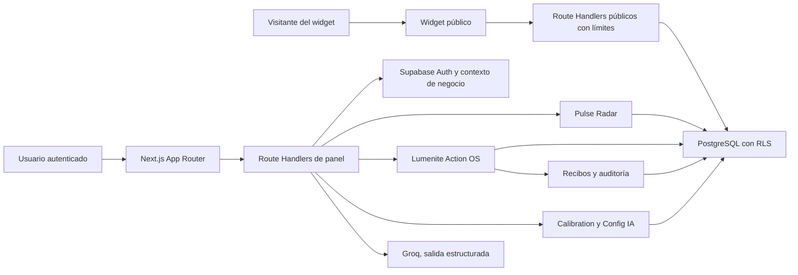

# LumenAI Product Architecture

## 1. Propósito

LumenAI es un sistema de inteligencia comercial y soporte para PYMES. Su promesa operativa es observar información autorizada, detectar señales, preparar decisiones y ejecutar únicamente acciones registradas bajo permisos explícitos.

La arquitectura separa responsabilidades:

- **Pulse Radar** observa, prioriza y explica.
- **Lumenite** planifica, autoriza, ejecuta y verifica.
- **Calibration** define personalidad, límites y comportamiento.
- **Knowledge** contiene información autorizada del negocio.
- **Chat y Leads** representan operación comercial real.
- **Widget** publica la experiencia en el sitio del negocio.
- **Supabase** aporta identidad, persistencia y aislamiento.

## 2. Mapa de alto nivel

## 3. Capas del repositorio

| Capa | Ruta | Responsabilidad |
| --- | --- | --- |
| Experiencia | `app/` | Rutas, layouts, loading y errores |
| Panel | `app/panel/` | Shell autenticado y módulos operativos |
| API | `app/api/` | Autenticación, validación y mutaciones de servidor |
| UI compartida | `components/` | Marca, controles, estados y visuales reutilizables |
| Dominio | `lib/` | IA, Lumenite, Pulse, tema y Supabase |
| Datos | `supabase/migrations/` | Esquema, índices, RLS, funciones y permisos |
| Verificación | `tests/`, `scripts/` | Contratos, seguridad y smoke tests |
| Decisiones | `docs/` | Arquitectura, diseño y readiness |

## 4. Rutas funcionales encontradas

- Identidad: `/login`, `/auth/*`, `/onboarding`.
- Operación: `/panel/overview`, `/panel/chat`, `/panel/chat/[id]`, `/panel/leads`.
- Inteligencia: `/panel/radar`, `/panel/lumen-eye`, `/panel/research`, `/panel/growth`, `/panel/twin`.
- Acción: `/panel/lumenite`, `/panel/campaigns`, `/panel/autoconfig`.
- Configuración: `/panel/knowledge`, `/panel/calibration`, `/panel/widget`, `/panel/settings`, `/panel/color-mix`.
- Confianza: `/panel/system-health`, `/support`, `/legal/*`.
- Publicación: `/widget`, `/widget/[key]`.

## 5. Datos reales y límites

Son reales cuando Supabase está disponible: sesión, negocio activo, chats, mensajes, leads, configuración del widget, conocimiento, calibración, señales derivadas de datos persistidos y ejecuciones de Lumenite.

No deben presentarse como conectados:

- OAuth de terceros.
- Calendarios, correo, CRM, Slack, Teams o WhatsApp transaccional.
- Automatizaciones externas.
- Métricas sin fuente, periodo y actualización verificables.

## 6. Límites de confianza

1. El navegador conserva sesión y solicita operaciones.
2. El servidor valida usuario y pertenencia al negocio.
3. Lumenite acepta un `runId` persistido, nunca un nombre de acción arbitrario.
4. El registro tipado valida entrada y salida.
5. Supabase aísla por `business_id`; el cliente administrativo sólo vive en servidor.
6. El resultado se verifica antes de emitir recibo.
7. La auditoría conserva quién solicitó, aprobó y ejecutó.

## 7. Deuda técnica protegida

- `app/globals.css` contiene capas históricas extensas. La fundación canónica nueva vive en `app/lumenai-obsidian.css`; no debe eliminarse CSS legado sin migrar y probar cada ruta.
- Algunas APIs antiguas resuelven el negocio con estrategias distintas. Deben converger gradualmente en una única función de autorización.
- Las migraciones nuevas necesitan ejecución real contra Supabase antes de producción.
- El worktree actual contiene cambios de varios hitos; la consolidación Git debe hacerse por alcance, sin revertir trabajo previo.

## 8. Orden de evolución

1. Seguridad y aislamiento.
2. Fundación visual y estados universales.
3. Lumenite interno y permisos.
4. Pulse Radar conectado a acciones.
5. Framework de integraciones.
6. Automatizaciones supervisadas.
7. Rediseño gradual de módulos.
8. QA, capturas, release y observabilidad.

