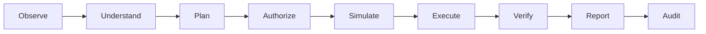

# Lumenite Action System

## 1. Modelo operativo

Lumenite nunca ejecuta texto libre generado por un modelo. Convierte una intencion en un plan estructurado y solo puede seleccionar capacidades del registro cerrado.

## 2. Registro cerrado

| ID | Accion | Recurso | Acceso | Riesgo | Undo |
| --- | --- | --- | --- | --- | --- |
| `internal.task.create` | Crear tarea | Task | create | Low | Si |
| `internal.lead.note.add` | Añadir nota a lead | Lead note | create | Low | Si |
| `internal.response.prepare` | Preparar respuesta | Response draft | create | Low | Si |
| `internal.conversation.tag` | Etiquetar conversacion | Conversation tag | create | Low | Si |
| `internal.reminder.create` | Crear recordatorio | Reminder | create | Low | Si |

El proceso falla al iniciar si el registro deja de contener exactamente estas cinco capacidades.

## 3. Contrato de capacidad

Cada capacidad declara identificador, proveedor, categoria, recurso, acceso, esquemas de entrada y salida, scopes, riesgo, aprobacion, dry-run, undo, timeout, reintentos, executor, verifier y reglas de redaccion.

El modelo solo propone un ID registrado y un objeto validado por su esquema. No puede proponer SQL, codigo, URLs ejecutables ni llamadas arbitrarias.

## 4. Estados persistidos

Los estados posibles son `draft`, `planning`, `awaiting_approval`, `approved`, `changes_requested`, `rejected`, `expired`, `queued`, `executing`, `verifying`, `completed`, `partially_completed`, `failed`, `cancelled`, `undo_available` y `reverted`.

Una accion que modifica datos y despues falla al verificar, auditar o compensar queda `partially_completed`; nunca se presenta como un fallo limpio.

## 5. Planes y versiones

Cada plan guarda version, plan raiz, plan padre y solicitud de cambio. Las versiones son inmutables. Pedir cambios crea una version sucesora, invalida la aprobacion anterior y obliga a una nueva decision humana incluso cuando una politica de nivel 4 permitiria autoejecucion.

## 6. Idempotencia y concurrencia

- La solicitud se serializa de forma determinista.
- Cada run recibe una clave SHA-256 por negocio y accion.
- PostgreSQL impone unicidad en `(business_id, idempotency_key)`.
- Ejecutar y deshacer reclaman el run mediante transiciones atomicas.
- Reintentar recupera el run existente y no repite la mutacion.

## 7. Autorizacion y revocacion

La autorizacion se calcula al planificar y se vuelve a comprobar al ejecutar. Una aprobacion caducada, una membresia suspendida o una politica revocada bloquean el run.

Las revocaciones cancelan trabajo pendiente e invalidan aprobaciones. Un run que ya esta en ejecucion recibe una señal de revocacion y, si produjo un efecto reversible, intenta undo antes de cerrar como `reverted` o `partially_completed`.

## 8. Verificacion, recibo y auditoria

Despues del executor:

1. Se valida el esquema de salida.
2. El verifier consulta la entidad real dentro del mismo `business_id`.
3. Se almacena evidencia y estado de reversibilidad.
4. Se emite un recibo con solicitud, accion, proveedor, verificacion, audit ID y undo.
5. Las decisiones, errores, revisiones y compensaciones quedan en auditoria.

## 9. Interfaces de servidor

| Endpoint | Metodo | Funcion |
| --- | --- | --- |
| `/api/panel/lumenite/plan` | POST | Comprender, planificar, autorizar y simular. |
| `/api/panel/lumenite/execute` | POST | Aprobar opcionalmente y ejecutar un run persistido. |
| `/api/panel/lumenite/action-runs` | GET/PATCH | Historial, inbox, rechazo, cambios y cancelacion. |
| `/api/panel/lumenite/rollback` | POST | Deshacer un run reversible. |
| `/api/panel/lumenite/policies` | GET/POST/PATCH/DELETE | Administrar politicas con revision y auditoria. |

## 10. Limites deliberados

No se implementan envios externos, acciones masivas, pagos, cambios de permisos, nivel 5, Automation Studio ni adaptadores OAuth. Incorporarlos exigira capacidades independientes, aprobaciones reforzadas, idempotencia del proveedor y pruebas de compensacion.

## 11. Verificacion reproducible

`npm run test:lumenite` crea un owner y un negocio aislados, configura una politica explicita para cada capacidad y recorre por API autenticada:

- Plan y simulacion.
- Aprobacion humana obligatoria.
- Ejecucion y persistencia tenant-scoped.
- Verificacion y recibo.
- Auditoria del plan, la ejecucion y la reversion.
- Idempotencia del plan, la ejecucion y el undo.
- Undo con comprobacion de que el recurso desaparecio.

La misma suite confirma que cancelar cierra tanto el run como su aprobacion pendiente y que un recurso eliminado entre planificacion y ejecucion produce `failed` con `RESOURCE_NOT_FOUND`, sin mutacion ni recibo de exito. `npm run test:action-os` protege ademas que todo fallo ocurrido despues de aplicar datos se conserve como `partially_completed`.
