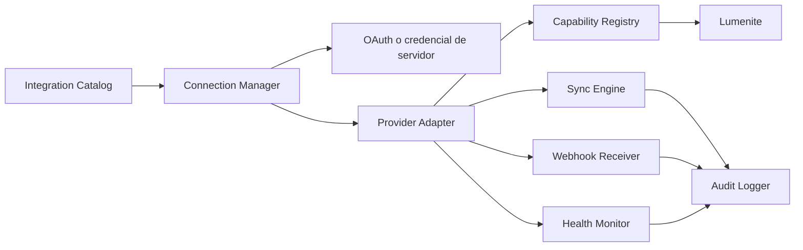

# Lumenite Integrations

## 1. Estado real

No hay proveedores externos conectados en la Fase 1. El proveedor operativo es interno (`Supabase`) y todas las capacidades escriben recursos propios de LumenAI.

La existencia de una tabla o tarjeta de integración no debe interpretarse como conexión OAuth, sincronización ni permiso concedido.

## 2. Arquitectura objetivo

Cada adaptador debe normalizar errores, scopes, límites, health checks, reautorización y desconexión.

## 3. Estados canónicos

`available`, `connecting`, `connected`, `syncing`, `healthy`, `degraded`, `permission_required`, `reconnect_required`, `disconnected` y `error`.

`connected` requiere comprobación real del proveedor. `healthy` requiere health check reciente. Una credencial guardada no basta.

## 4. Catálogo planificado

| Categoría | Proveedores candidatos | Prioridad | Estado |
| --- | --- | --- | --- |
| Productividad | Google Calendar, Outlook Calendar | P1 | No conectado |
| Comunicación | Resend/Email, Slack, Teams | P1-P2 | No conectado |
| CRM | HubSpot, Airtable | P2 | No conectado |
| Operación | Webhooks firmados | P1 | No conectado |
| Pagos | Stripe | P3 | No conectado; high/critical risk |

La selección final necesita autorización del owner, revisión de marketplace y definición de scopes mínimos.

## 5. Contrato de conexión

Una conexión deberá conservar proveedor, cuenta, negocio, scopes, capacidades, estado, última sincronización, último error normalizado, expiración, autonomía y timestamps. Tokens y secretos nunca se devuelven al cliente.

## 6. Gate para la primera integración

1. Acción interna equivalente verificada.
2. Permiso y riesgo definidos.
3. OAuth o secreto almacenado sólo en servidor.
4. Callback con `state` y redirect seguro.
5. Health check real.
6. Idempotencia externa y referencia del proveedor.
7. Webhook firmado cuando corresponda.
8. Auditoría y redacción.
9. Reconexión y desconexión probadas.
10. Integración test y E2E multitenant.

## 7. Recomendación

La primera integración debería ser de productividad y bajo impacto, por ejemplo crear un evento de calendario siempre con aprobación. No debe comenzar hasta aplicar y validar las migraciones de Hitos 0-2.

